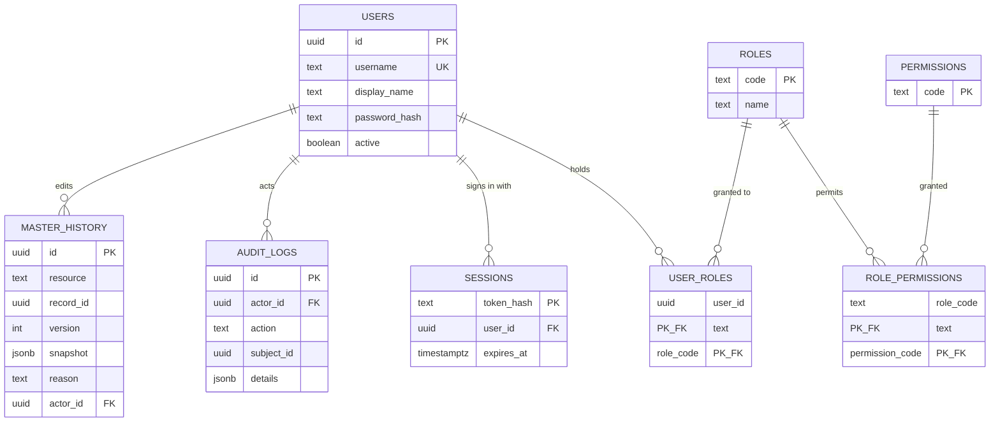
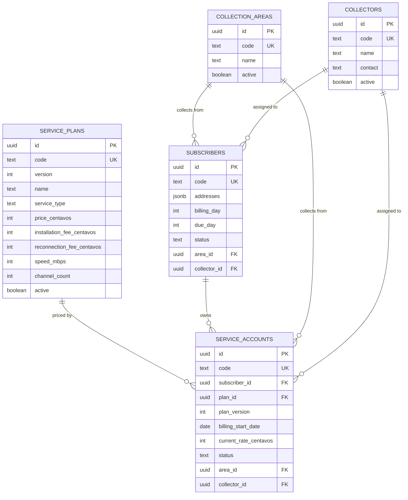
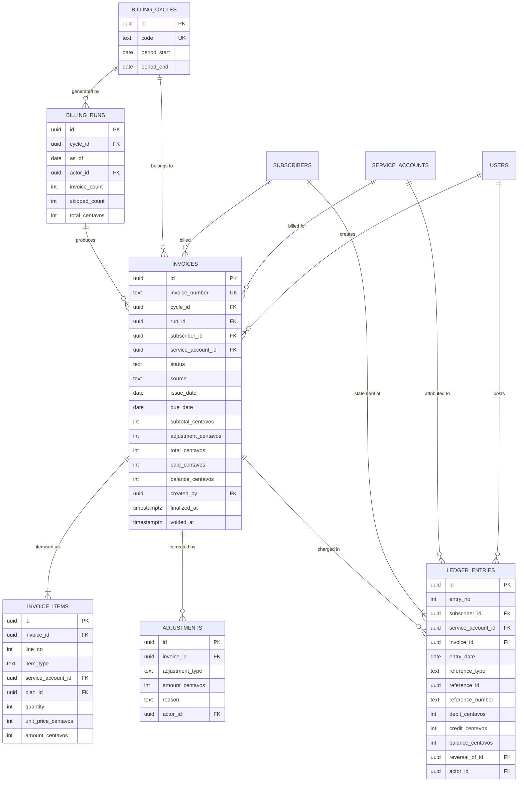
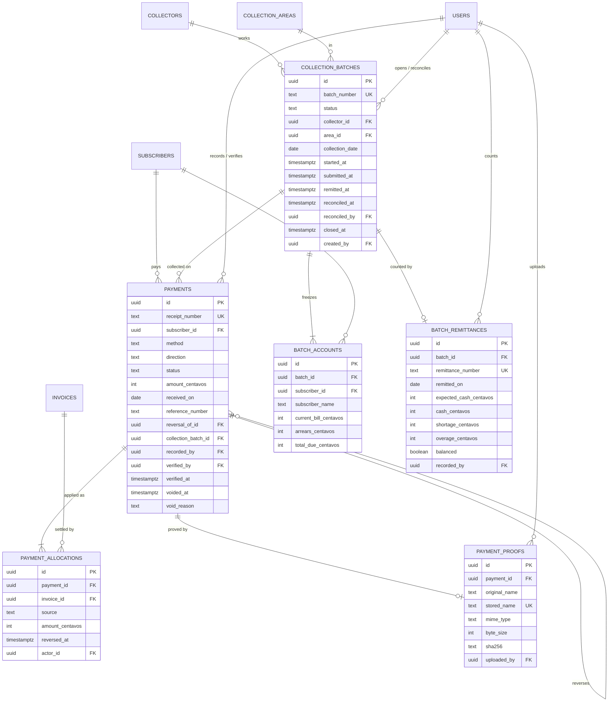
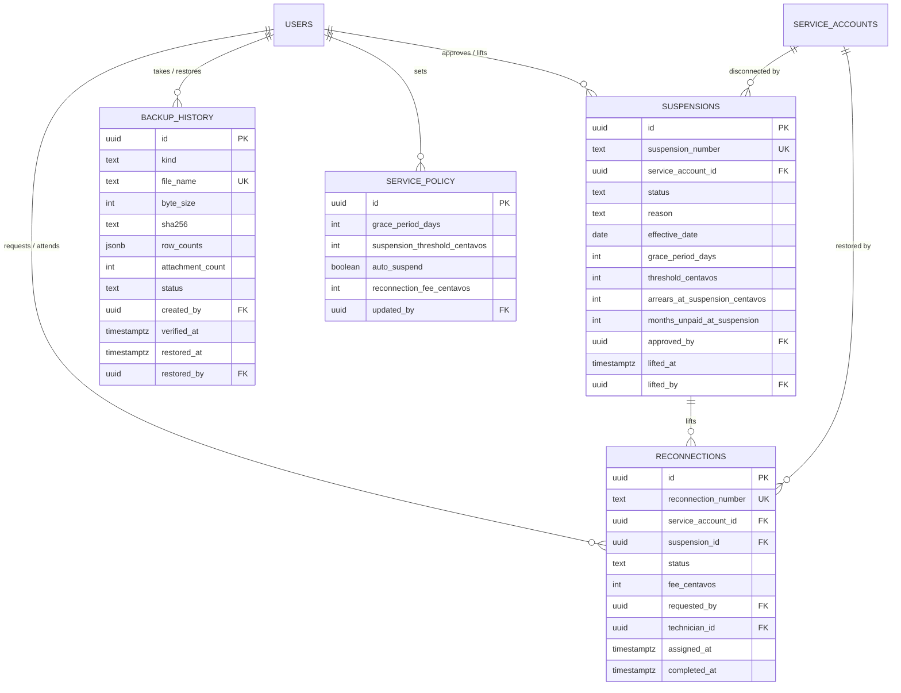

# Entity relationship diagram

The design-time source of truth is `database/schema.ts`; the database is built from
`database/migrations/0000` to `0019` by `npm run db:migrate`. This document is the picture of
what those migrations create, so a reviewer can read the model without walking twenty SQL
files. Nothing here overrides the schema: if the two disagree, the schema is right and this
page has a defect.

Conventions used throughout:

- Every primary key is a `uuid` except where a natural key is the identity: `roles.code`,
  `permissions.code`, `service_plans.code`, `collection_areas.code`, `collectors.code`,
  `subscribers.code`, `application_metadata.key`, `sessions.token_hash`,
  `document_sequences(kind, year)` and the two join tables.
- Every money column is an integer of **centavos** (`*_centavos`), never a float. Signed
  columns are only `invoices.adjustment_centavos` and `invoice_items.amount_centavos`, because
  discounts and credit adjustments are negative while every stored total stays non-negative.
- `*Centavos` columns, counts and amounts carry a database check bounding them to
  0–999,999,999 (or ±999,999,999 for the signed pair), so a `bigint` aggregate can never
  overflow an `integer` total.
- Timestamps are `timestamptz`; dates that represent a document date or a period boundary are
  `date`.
- Referential actions are `restrict` on financial children (`invoice_items`, `adjustments`,
  `ledger_entries` including its reversal link, `payment_allocations`, `payment_proofs`,
  `payments.reversal_of_id`, `payments.collection_batch_id`, `batch_accounts.batch_id`,
  `batch_remittances.batch_id`, and both service-control documents), `cascade` on exactly two
  identity rows (`user_roles.user_id`, `sessions.user_id`), and the default `no action`
  everywhere else — so an actor, a subscriber or a plan that is referenced can never quietly
  disappear from the history.

## 1. Identity, security and audit

Authorisation is data, not code: a request is checked against `role_permissions` through
`users → user_roles → roles → role_permissions`. Roles are seeded by
`database/seed-security.ts` (OWNER, ADMIN, CASHIER, SUPERVISOR, AUDITOR, TECHNICIAN,
VIEWER) and no migration writes permission rows, so a database seeded before a new permission
existed must re-run that seed — this is the defect recorded as #3 in
[acceptance](ACCEPTANCE.md#defect-log).

`master_history` keeps one row per successful edit of a master record keyed by
`(resource, record_id, version)`; failed or stale edits write nothing. `audit_logs` is the
cross-cutting trail (who did what, to which subject, with what detail) and never stores a
password, a token hash or a connection string.

## 2. Master data

One subscriber may hold several service accounts (an internet line and a cable line), each
frozen to the plan version and rate that applied when it was taken, so a later price change
never rewrites an existing account or a posted invoice. Subscriber and account `status` are
constrained to their enumerated values (`ACTIVE`, `INACTIVE`, `TERMINATED`, `ARCHIVED` for
subscribers; `PENDING`, `ACTIVE`, `SUSPENDED`, `INACTIVE`, `TERMINATED`, `ARCHIVED` for
accounts). Both carry `billing_day`/`due_day` between 1 and 31.

## 3. Billing and the ledger

Rules the diagram cannot draw, all enforced in the database:

- `invoices_service_cycle_idx` — at most one non-`DRAFT`/non-`VOID` invoice per
  `(service_account, cycle)`, which is AT-11.
- `invoices` totals are self-checking: `subtotal + adjustment = total` and
  `balance = total − paid`, so a stored row can never disagree with itself.
- `ledger_entries` restart `entry_no` at 1 per subscriber (the worksheet statement
  numbering), each row is a single side (`debit XOR credit`), and the running
  `balance_centavos` is rebuilt and re-checked whenever a back-dated entry is posted.
- Posted invoices and ledger rows are append-only: triggers in `0007`, `0008`, `0012` and
  `0015` refuse `UPDATE`/`DELETE`, so corrections are made with a reversal, an adjustment or
  a void that keeps the original row.

## 4. Payments, proofs and collections

- A payment's `status` machine (`PENDING`, `POSTED`, `REVERSED`, `VOID`) and its `direction`
  (`PAYMENT`, `REVERSAL`) are one check constraint: a `PENDING` row has no receipt number and
  is always GCash; a `REVERSAL` row must name `reversal_of_id` and a reason; a void or a
  reversal must carry `voided_at` and a reason.
- One receipt number per posted document, gap-free per year, allocated from
  `document_sequences` under an advisory lock — this is what AT-09 exercises concurrently.
- One GCash reference identifies one transfer: `payments_gcash_reference_idx` is unique
  while the row is not `VOID`.
- An allocation stands while `reversed_at IS NULL`; a reversal keeps the row and marks it, so
  the applied history stays complete.
- A batch freezes its route into `batch_accounts` when it is opened (names and amounts are
  copied, not joined, so a later rename cannot rewrite the sheet the collector carried), and
  every collected figure is derived from the posted payments that carry
  `collection_batch_id`. One remittance per batch, and the variance identity
  `cash − expected = overage − shortage` with at most one of shortage/overage non-zero pins
  AT-07 and AT-08.

## 5. Service control and backup

`service_policy` is a single current row (grace days, suspension threshold, whether the
system may suspend automatically, reconnection fee) stamped with who last changed it.
Suspension states are `ACTIVE`, `LIFTED`, `CANCELLED`; reconnection states are `REQUESTED`,
`ASSIGNED`, `COMPLETED`, `CANCELLED`, and a reconnection may exist without a suspension
(a good-standing customer paying a reconnection fee).

`backup_history` records the digest and the row counts of each archive, so a restore can be
checked twice: the digest proves the file is the one that was taken, the counts prove what it
contained. The archive file itself is never inside the database and its path is never
returned by the API.

## 6. Relationship inventory

The `ON DELETE` column is what the migrations actually contain (`0001`–`0017`); `no action`
is PostgreSQL's default and behaves as a refusal to delete a referenced parent.

| Parent | Child | Foreign key | On delete |
|---|---|---|---|
| `users` | `user_roles` | `user_id` | cascade |
| `users` | `sessions` | `user_id` | cascade |
| `roles` | `user_roles` | `role_code` | no action |
| `roles` | `role_permissions` | `role_code` | no action |
| `permissions` | `role_permissions` | `permission_code` | no action |
| `users` | `audit_logs` | `actor_id` | no action |
| `users` | `master_history` | `actor_id` | no action |
| `collection_areas` | `subscribers`, `service_accounts`, `collection_batches` | `area_id` | no action |
| `collectors` | `subscribers`, `service_accounts`, `collection_batches` | `collector_id` | no action |
| `subscribers` | `service_accounts` | `subscriber_id` | no action |
| `service_plans` | `service_accounts` | `plan_id` | no action |
| `subscribers` | `invoices`, `ledger_entries`, `payments`, `batch_accounts` | `subscriber_id` | no action |
| `service_accounts` | `invoices`, `ledger_entries` | `service_account_id` | no action |
| `service_accounts` | `invoice_items` | `service_account_id` | no action |
| `service_accounts` | `suspensions`, `reconnections` | `service_account_id` | restrict |
| `billing_cycles` | `billing_runs`, `invoices` | `cycle_id` | no action |
| `billing_runs` | `invoices` | `run_id` | no action |
| `users` | `invoices`, `billing_runs`, `adjustments`, `ledger_entries` | `created_by`, `actor_id` | no action |
| `invoices` | `invoice_items`, `adjustments`, `ledger_entries`, `payment_allocations` | `invoice_id` | restrict |
| `service_plans` | `invoice_items` | `plan_id` | no action |
| `payments` | `payment_allocations`, `payment_proofs` | `payment_id` | restrict |
| `payments` | `payments` (reversal) | `reversal_of_id` | restrict |
| `payments` | `collection_batches` (its own FK) | `collection_batch_id` | restrict |
| `users` | `payments` | `recorded_by`, `verified_by` | no action |
| `users` | `payment_proofs` | `uploaded_by` | no action |
| `collection_batches` | `batch_accounts`, `batch_remittances` | `batch_id` | restrict |
| `subscribers` | `batch_accounts` | `subscriber_id` | no action |
| `users` | `batch_remittances`, `collection_batches` | `recorded_by`, `reconciled_by`, `created_by` | no action |
| `suspensions` | `reconnections` | `suspension_id` | restrict |
| `users` | `service_policy`, `suspensions`, `reconnections`, `backup_history` | `updated_by`, `approved_by`, `lifted_by`, `requested_by`, `technician_id`, `created_by`, `restored_by` | no action |

`ledger_entries.reversal_of_id` and `payments.reversal_of_id` are self-references: a reversal
is a new row pointing at the original, never an edit of it.

## 7. Reading the model

- Money: multiply by 100 to read centavos as pesos; `integer` centavos are exact, floats are
  refused at every boundary (see `tests/unit/billing.test.ts`).
- Documents: numbers are gap-free per year from `document_sequences`
  (`INV-2026-0001`, `RCT-2026-1001`, `BCH-2026-0001`, `RMT-2026-0001`,
  `SUS-2026-0001`, `RCO-2026-0001`) and are never reused after a void.
- History: anything the office has seen — a posted invoice, a ledger line, a posted payment,
  a frozen route, a counted remittance — is written once. Corrections are new rows
  (adjustment, reversal, void, new remittance) carrying an actor and a reason.
- The worked example of every relationship in this document, with the numbers the laboratory
  asks for, is the demonstration dataset described in [demo dataset](DEMO_DATASET.md).
